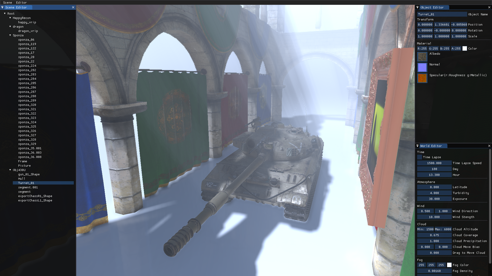
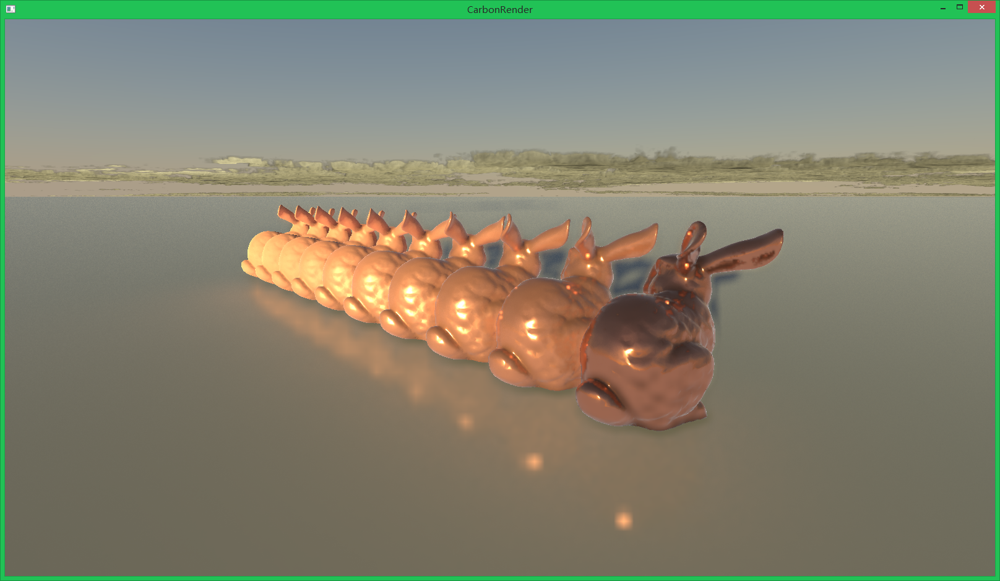
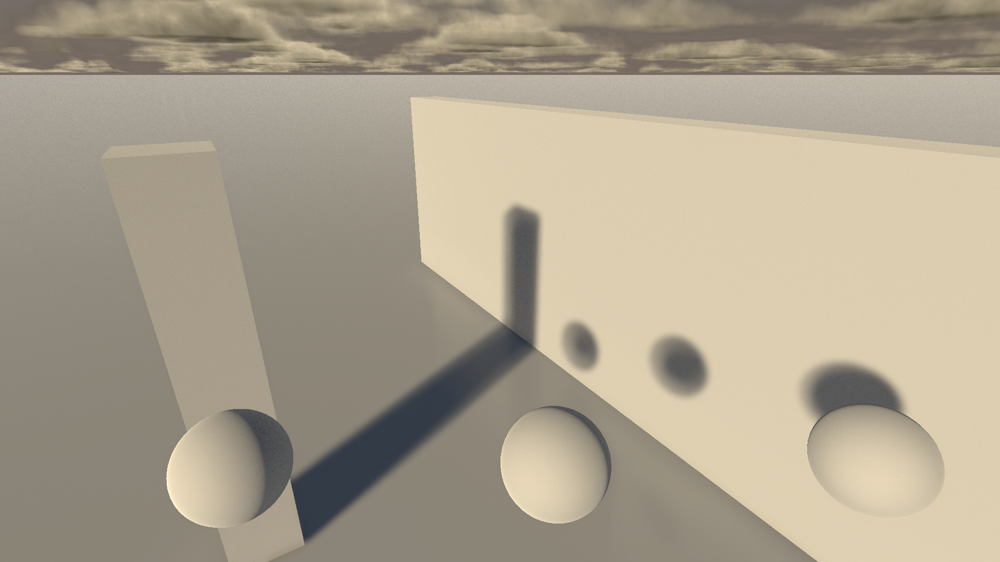
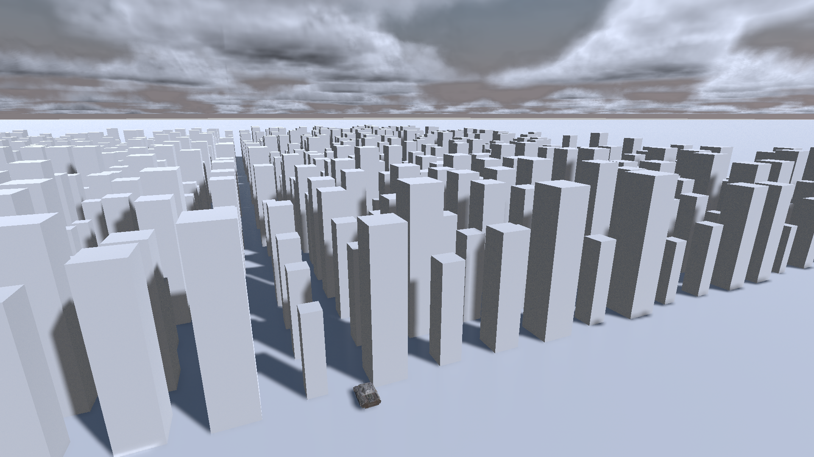
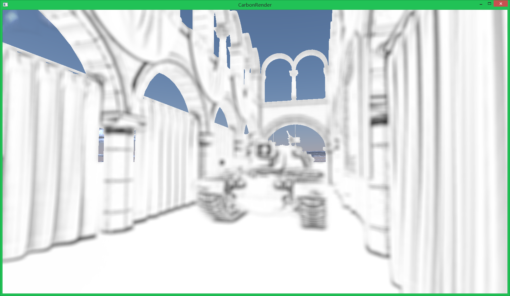
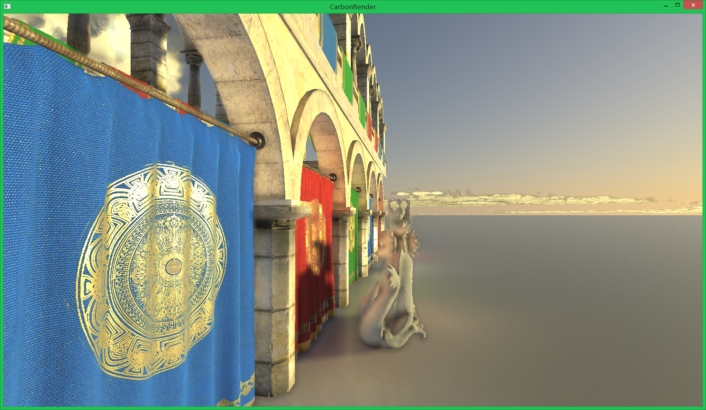
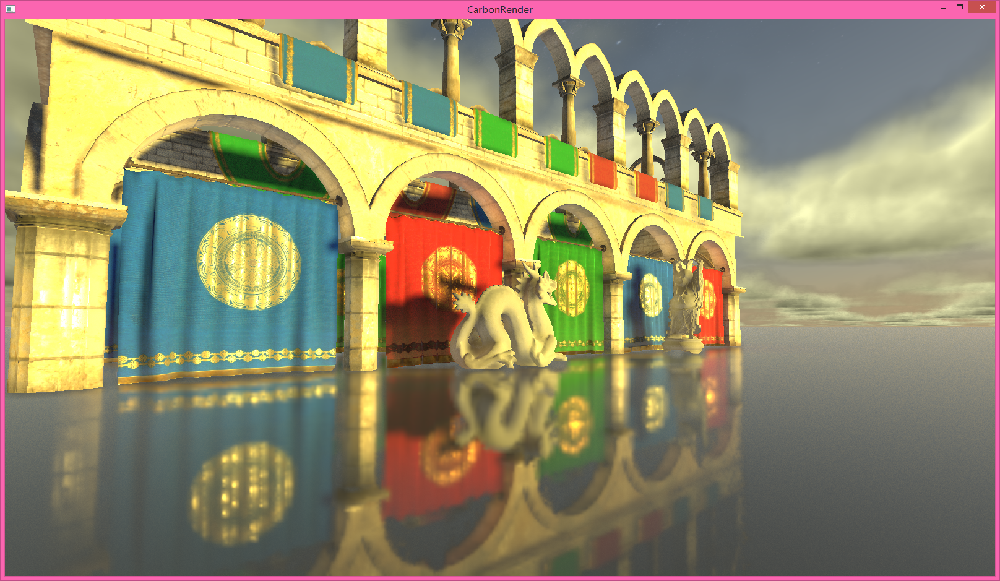
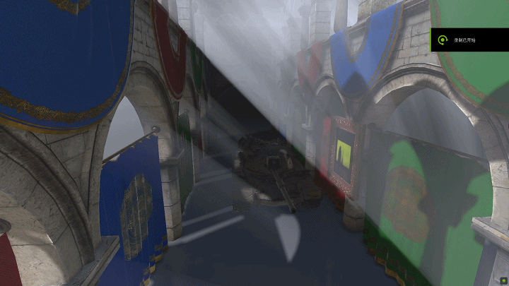

# CarbonRender
A real-time rendering engine based on C++ and OpenGL

### **Features:**
* Deferred Shading pipeline

* Physically based rendering

* Linear space lighting

* PCSS & CSM shadow

* Alchemy AO

* Real-time RSM GI, no precomputing

* Screen space reflection

* Real-time volumetric cloud

* Real-time atmosphere scattering

* Real-time volumetric fog

### **Future Work:**

* HDR

* FFT Ocean

* Terrain System

* UI and Editor

* New Atmosphere Scattering Method

* Night Sky
